

  

  
  

I'm a <strong>Generative AI & Full-Stack Engineer</strong> specializing in building production-grade AI applications, intelligent agents, and modern full-stack products.

I design and ship AI systems end-to-end—from LLM integrations and multi-agent workflows to RAG & Graph RAG pipelines, voice AI, automation, scalable Python backends, and performant Next.js/React frontends.

  
  
  
  
  
  

---
# Highlights

✔ Built production AI systems for startups and enterprise clients

✔ Delivered AI Agents, Voice AI and RAG applications

✔ Built multi-agent orchestration using LangGraph, AutoGen, CrewAI & MCP

✔ Designed Graph RAG pipelines with Neo4j

✔ Developed scalable FastAPI backends serving thousands of requests

✔ Built modern Next.js & React applications

✔ Integrated OpenAI, Gemini, Claude, Azure OpenAI, Groq and Llama models

✔ Experience across Healthcare, FinTech, Insurance & B2B SaaS

---
# Tech Stack

  

  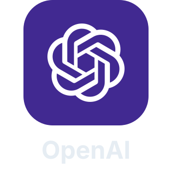
  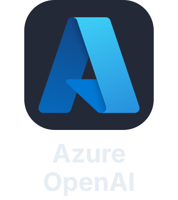
  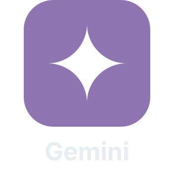
  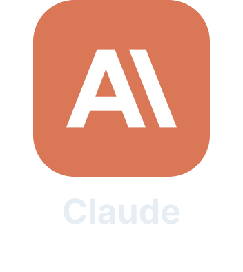
  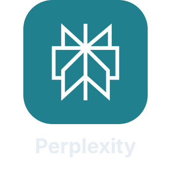
  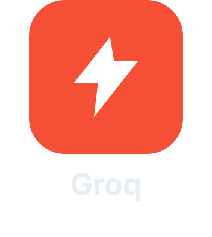
  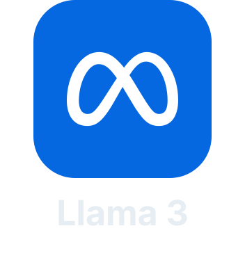
  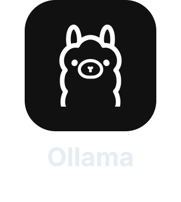
  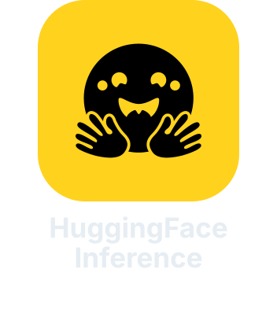

  

  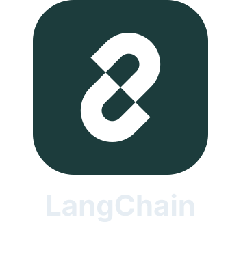
  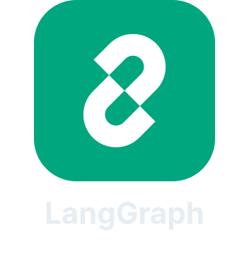
  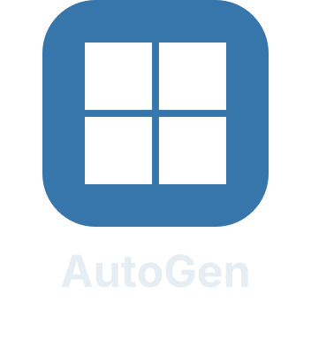
  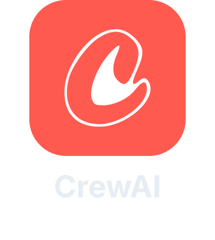
  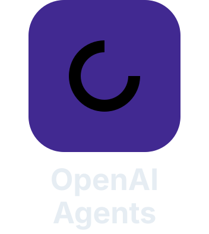
  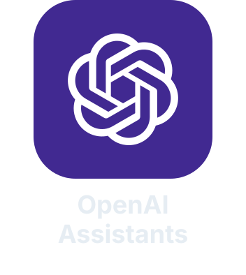
  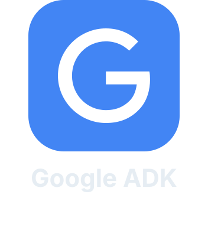
  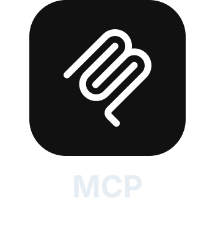

  

  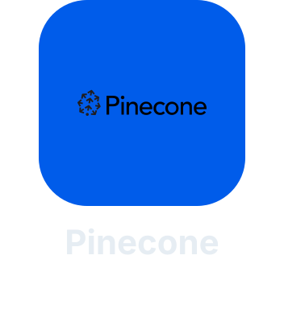
  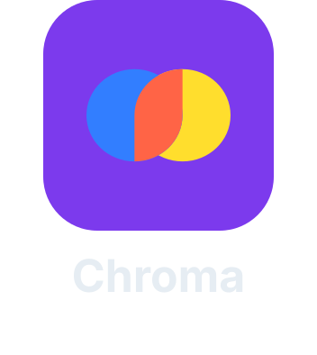
  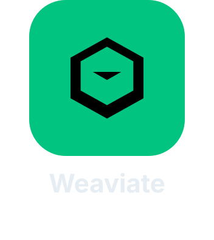
  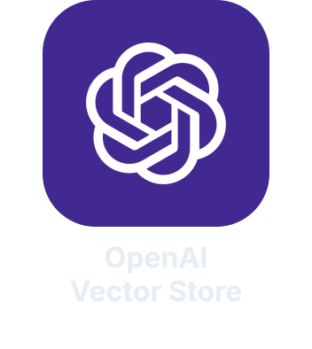
  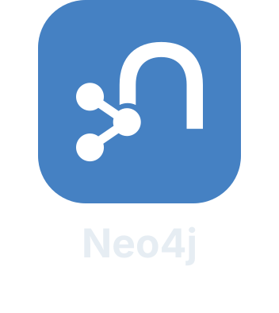
  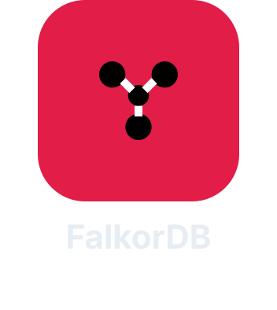

  

  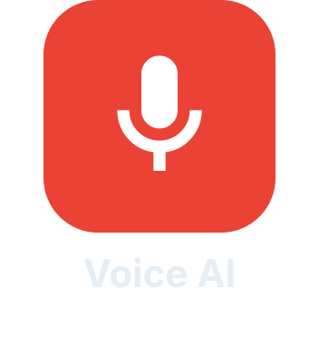
  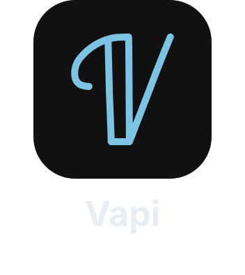
  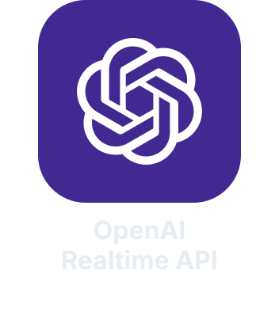
  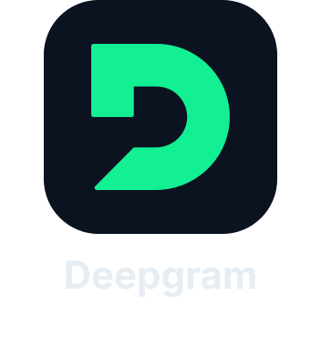
  

  

  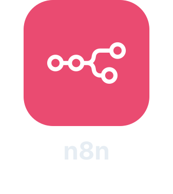
  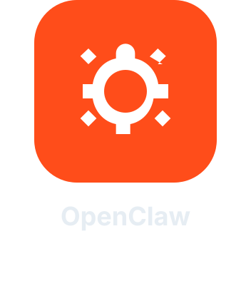
  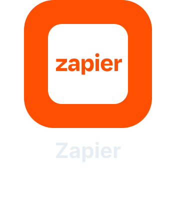
  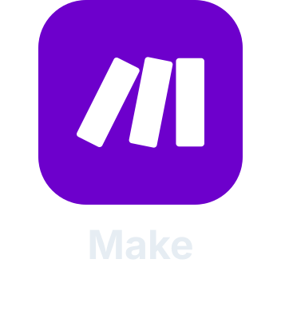

---

  

  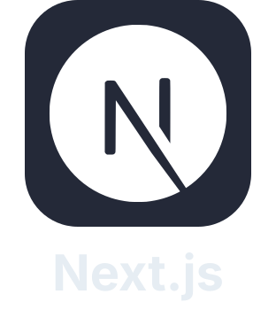
  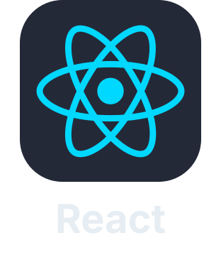
  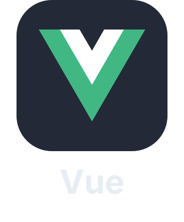
  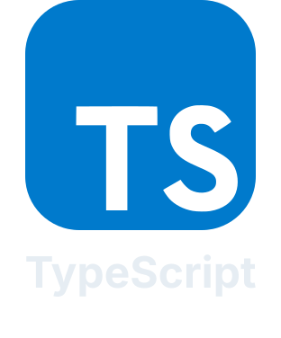
  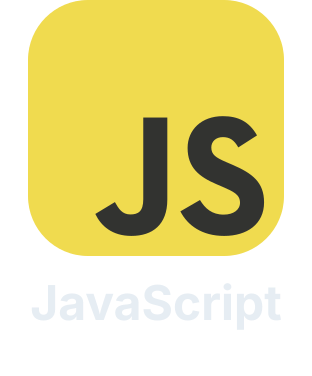
  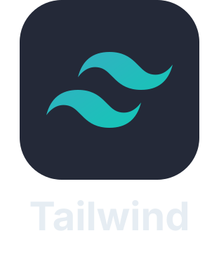
  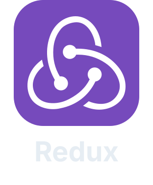
  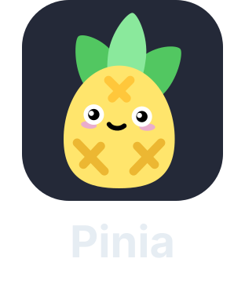
  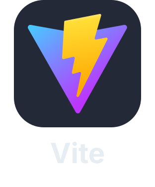
  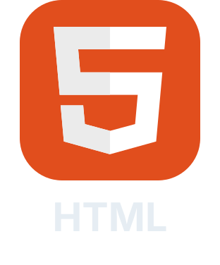
  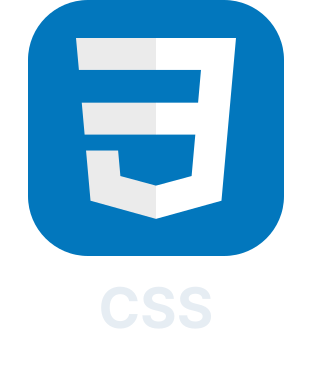

  

  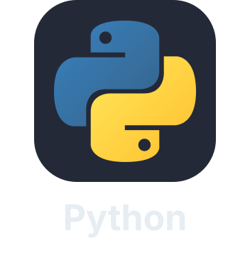
  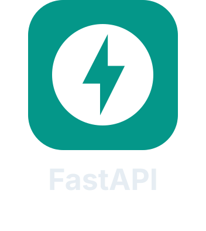
  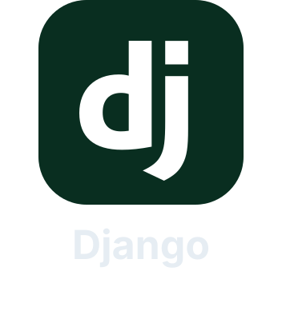
  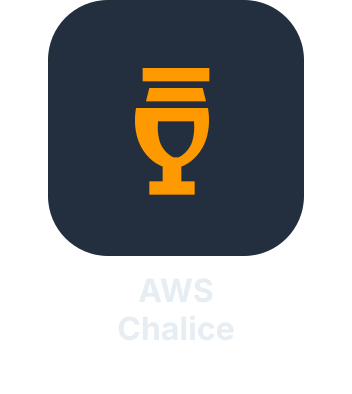
  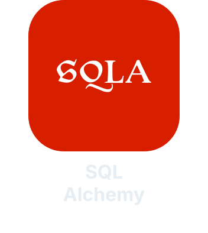
  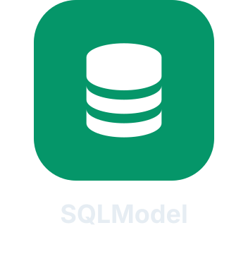
  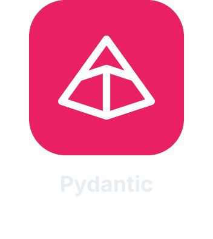
  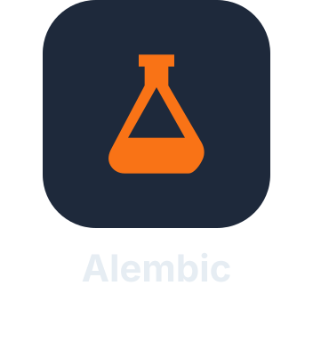

  

  
  
  
  
  
  
  
  

---

  

  
  
  
  
  
  
  

---

# GitHub Contributions

---
